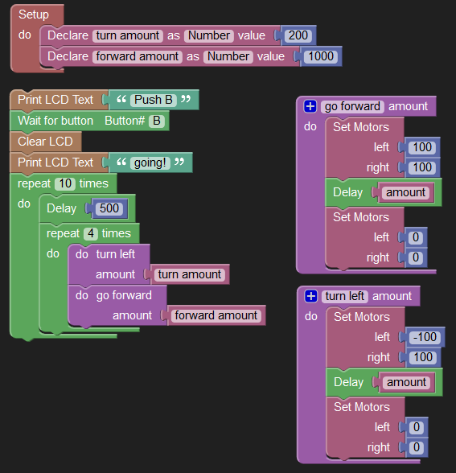

Anibit Visual Robot Programmer
=============================

This is a tool for getting started with very low effort and cost entry into teaching programming robotics to beginners.

This tool allows beginners to create programs for robots by dragging "blocks" around on screen visually to create a set of instructions for a robot.

This is what a program to move the robot in a square 10 times looks like:

You can see a live in action at [https://anibit.com/webtools/3pi/](https://anibit.com/webtools/3pi/)

Overview
--------
This software has two flavors, a "web-app", and a traditional desktop application. The desktop application is optional, and a lot can be done with only the web app. The web app can run completely offline, from a browser's cache, too.
 

*Note: It's called a 'web-app' because it is written in HTML and JavaScript, and run's inside a web browser, but you can open the HTML files locally in Firefox and use the web-app offline.*
  

The desktop application "wraps" the web-app, and makes it even easier for beginners by automating the program upload to the robot. The desktop application works on Microsoft Windows only. It makes it easier to program the robot by interacting with the Arduino desktop software to automate the process of compiling code and uploading it to the attached robot. 

Acknowledgments
---------------

The Anibit Visual Robot Programmer was on top of some pretty amazing technology without which it might not have been possible.

* [Blockly](https://developers.google.com/blockly/) - a general graphical programming environment for the web
* [Blocklyduino](https://github.com/gasolin/BlocklyDuino/wiki) - an adaptation of Blockly targeted toward the Arduino. 
* [MIT App Inventor 2](http://ai2.appinventor.mit.edu) - A graphical web-based development environment for Android apps.
* [Pololu Arduino Library for 3Pi](https://www.pololu.com/docs/0J17/5) - Provided libraries that are used to interact wit their 3Pi robot
* [Arduino](http://www.arduino.cc/) - the platform and software that started it all!

Getting started
---------------

###Installation

#####Running the web-app

Everything to run the webapp is in the code/web/apps/blocklyduino folder. If you wish to deploy it to your webserver, make the contents of that folder your root.  It also works in Firefox(as of version 34) by opening the index.html from your local hard drive. Chrome and IE have problems running the file locally due to the way they implement security. 

#####Running the Desktop application

(coming soon)

**NOTE The desktop application is still in development, and has not been released yet. Check back soon for more updates/**

Known Issues and Limitations
----------------
* Supported Browsers
	* FireFox 29+
	* Chrome 39+
	* Safari (Tested on OSX 10.8)
	* Internet Explorer 11 (see note)
* Internet Explorer is somewhat broken, there are major usability issues.
* Function Blocks that return values will results in Arduino code with errors. 
* Local variables are not really supported yet. Function parameters are local to the function block, but all other variables are declared locally, even used entirely within a function block.
* No support for floating point
* No options for converting numbers to text
* The user interface can be difficult to use on mobile devices, we want to fix that eventually.

License
-------

All of this is "open source" and free to use and modify under the Apache(web app) and BSD(desktop application) licenses. 

I would like you to make use of this tool to help you. We're very interested in helping to fan the flames of inspiration when it comes to robotics and programming. We plan to add features over time. If you would like to see some features added, feel free to let us know. We can't accommodate everything, but we also are available for hire for help and customization. 

It would be cool if you dropped us a note at anibit.technology@gmail.com if you find it useful. 